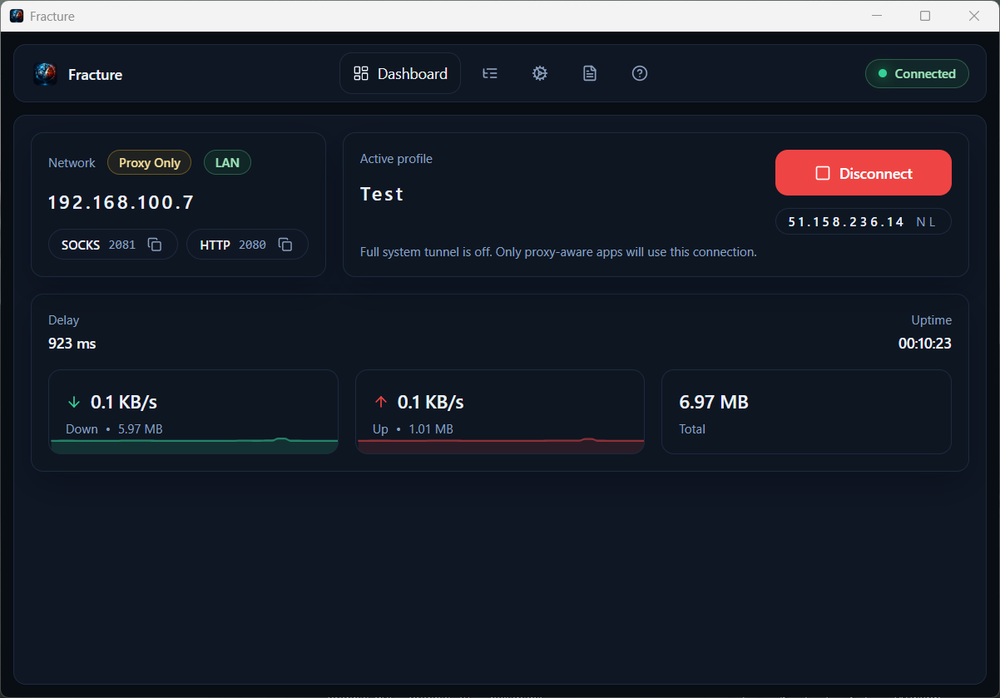
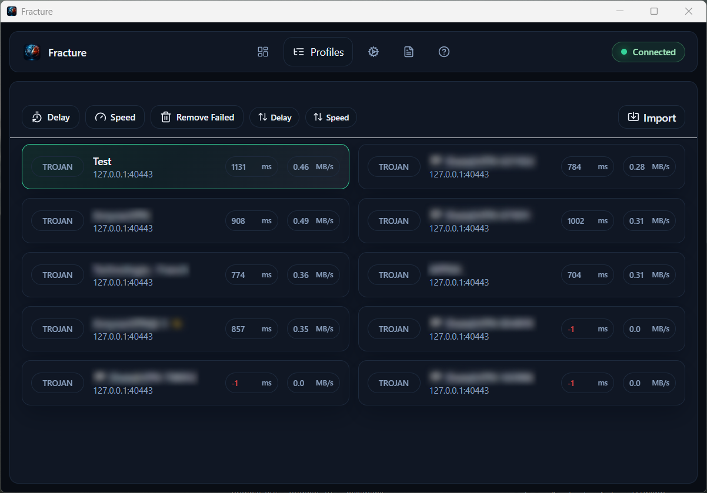
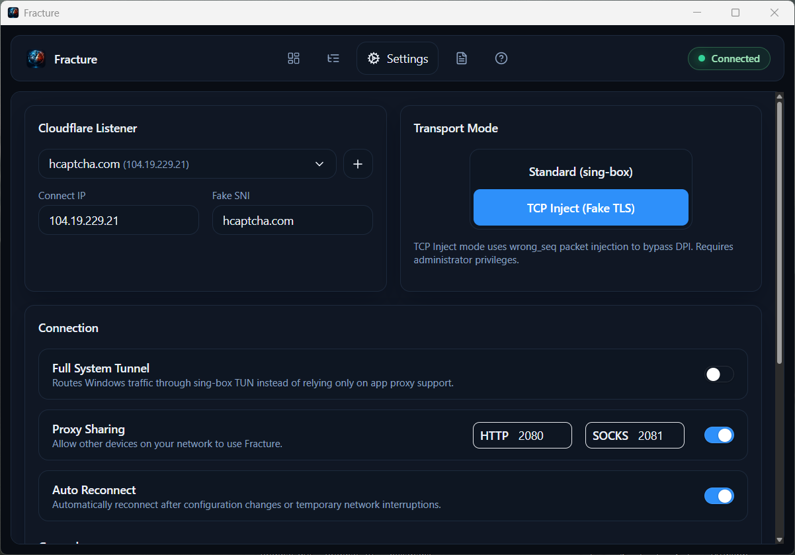
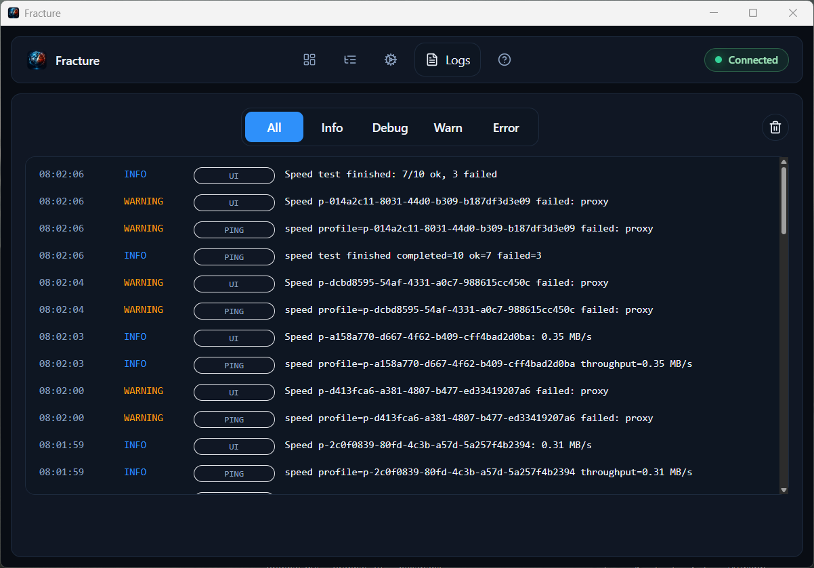

# Fracture

[English](README.md) | فارسی

[](https://github.com/mborjian/Fracture/releases) [](https://github.com/mborjian/Fracture/stargazers) [](https://github.com/mborjian/Fracture/issues) [](LICENSE)

Fracture یک پنل دسکتاپ ویندوز است که مدیریت پروفایل‌های `sing-box`، runtime محلی پروکسی و تنظیمات Cloudflare listener را در یک برنامه یکپارچه ارائه می‌دهد.

این ابزار برای کاربری ساده و مدیریت موثر در همین اپلیکیشن طراحی شده است؛ بدون نیاز به اسکریپت‌نویسی یا اجرای دستی دستورات در ترمینال.

## Screenshots

<p align="center">
  
  
</p>
<p align="center">
  
  
</p>

---

## Fracture چه کاری انجام می‌دهد

- وارد کردن پروفایل‌های proxy از لینک‌های subscription، URIها یا فایل‌های متنی
- سازمان‌دهی پروفایل‌ها با تغییر نام، مرتب‌سازی، export، حذف و انتخاب پروفایل فعال
- اجرای تست‌های ping و speed قبل از اتصال
- ویرایش JSON Cloudflare listener مستقیماً در رابط کاربری
- کنترل وضعیت runtime محلی، پورت‌های proxy، حالت routing، اشتراک LAN و رفتار startup
- پایش وضعیت لحظه‌ای، logها، اطلاعات egress و آمار ترافیک

## انواع پروفایل‌های پشتیبانی‌شده

Fracture فرمت‌هایی را که pipeline جاری برنامه پشتیبانی می‌کند می‌پذیرد، از جمله:

- `vless://`
- `vmess://`
- `trojan://`
- `ss://`
- `socks://`
- `http://`
- `hysteria2://`
- `tuic://`
- `wireguard://`
- `naive+https://`
- `naive+quic://`
- `anytls://`

## شروع سریع

1. Fracture را باز کنید.
2. پروفایل‌ها را import یا paste کنید.
3. در صورت نیاز آن‌ها را تست کنید.
4. پروفایل فعال را انتخاب کنید.
5. از داشبورد runtime را start کنید.

## ساختار پروژه

- `apps/desktop` — رابط کاربری دسکتاپ ساخته شده با Tauri و React
- `apps/backend` — سرویس FastAPI برای ذخیره پروفایل، کنترل runtime و به‌روزرسانی لحظه‌ای
- `sing-box/` — فایل‌ها و دارایی‌های runtime `sing-box`
- `configs/` — پوشه‌های runtime تولیدشده و لاگ‌ها
- `data/` — تنظیمات محلی، پروفایل‌ها و وضعیت Cloudflare listener

## داده‌های محلی

Fracture وضعیت و پیکربندی را در فایل‌های محلی ذخیره می‌کند مانند:

- `data/profiles.json`
- `data/cloudflare-config.json`
- `data/app-settings.json`
- `configs/`

این داده‌ها فقط روی همان دستگاه نگهداری می‌شوند و به‌صورت پیش‌فرض به اشتراک گذاشته نمی‌شوند.

## توسعه

برای توسعه، backend و دسکتاپ را با هم اجرا کنید:

```powershell
npm run run
```

برای ساخت نسخه release:

```powershell
npm run build:release
```

## پشتیبانی و منابع

- مخزن GitHub: [mborjian/Fracture](https://github.com/mborjian/Fracture)
- نسخه‌ها: [دانلود از GitHub Releases](https://github.com/mborjian/Fracture/releases)
- ثبت مشکل: [Issues](https://github.com/mborjian/Fracture/issues/new/choose)
- ستاره: [ستاره دادن](https://github.com/mborjian/Fracture/stargazers)
- فورک: [Fork](https://github.com/mborjian/Fracture/fork)
- دنبال کردن: [Watch](https://github.com/mborjian/Fracture/subscription)

کیف پول‌های کمک مالی برای حمایت از توسعه‌دهنده:

- TON: `UQATECPeh89wITfWeFkUuO0o30Gup5QhmDlx9KWYNz54VCjN`
- USDT TRC20: `TF24QUZmpznKqrnjN6GhawW45Nx1DBALtR`
- TRX TRC20: `TF24QUZmpznKqrnjN6GhawW45Nx1DBALtR`
- SOL Solana: `5dGZcqQGECrczAtqfhrMn4A8VHLKR3qNx5Jaq8vAamyr`

## قدردانی

Fracture بر پایه ایده‌ها و پروژه‌های متن‌باز پیشین ساخته شده است.

- [g3ntrix/Cloak](https://github.com/g3ntrix/Cloak)
- [patterniha/SNI-Spoofing](https://github.com/patterniha/SNI-Spoofing)

## مجوز

این پروژه تحت شرایط [LICENSE](LICENSE) منتشر شده است.
